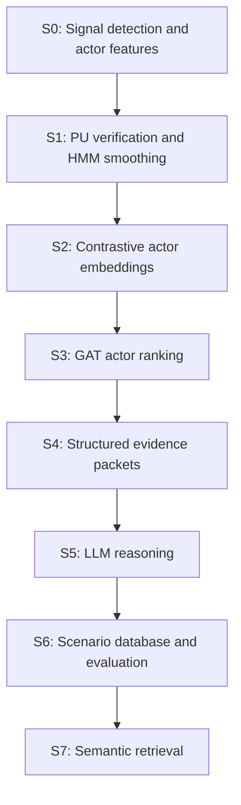

# Signals to Semantics

**An LLM-driven learning pipeline for novel driving-scenario discovery**

This repository is the cleaned research artifact for the Master's thesis
*From Signals to Semantics: An LLM-Driven Learning Pipeline for Novel
Driving-Scenario Discovery* by Hariharan Chandrasekaran.

It turns low-level ego-vehicle motion signals into searchable, human-readable
driving scenarios. The pipeline detects braking events, verifies them with
positive-unlabeled learning, ranks potentially responsible actors, assembles
structured evidence, asks an LLM to explain the event, and stores the result
for semantic retrieval.

The repository contains source code, reproducible split manifests, sanitized
configuration templates, synthetic examples, schemas, and compact verified
results. It intentionally does **not** contain raw Argoverse 2 data, credentials,
model checkpoints, database dumps, or bulk generated artifacts.

## Pipeline



| Stage | Purpose | Main output |
|---|---|---|
| S0 | Detect candidate braking windows and derive ego-relative actor features | JSONL windows and actor-feature Parquet |
| S1 | Verify candidates using PU-XGBoost and nnPU, then fuse and smooth scores with an HMM | Final event scores and episodes |
| S2 | Learn contrastive actor representations | Per-actor embeddings |
| S3 | Build quasi-temporal graphs and rank actors with a GAT | Top-k responsible-actor candidates |
| S4 | Combine event, actor, map, and ranking evidence | One JSON evidence packet per window |
| S5 | Classify and explain scenarios with Azure OpenAI or local Ollama models | Structured LLM JSON |
| S6 | Ingest the trace into PostgreSQL and evaluate reasoning outputs | Relational scenario trace and scoreboards |
| S7 | Embed and retrieve similar scenarios using natural-language queries | Ranked retrieval results |

The thesis-stable S1 sequence uses HMM smoothing. Experimental HSMM work and
other follow-up variants are outside this release.

## Key design contributions

- A recall-first braking-event proposal stage based on smoothed ego velocity,
  acceleration, jerk, and speed loss.
- Hybrid event verification using PU-XGBoost, nnPU learning, score fusion, and
  temporal HMM stabilization.
- Actor prioritization that combines learned contrastive representations with
  quasi-temporal GAT ranking.
- Deterministic evidence packets that constrain LLM reasoning to traceable
  kinematic, map, and actor evidence.
- A normalized PostgreSQL and pgvector trace connecting event detection,
  actor ranking, scenario reasoning, and semantic retrieval.

## Technology

Python, NumPy, pandas, SciPy, XGBoost, PyTorch, PyTorch Geometric, Argoverse 2,
Azure OpenAI, Ollama, PostgreSQL, pgvector, SQLAlchemy, and scikit-learn.

## Verified thesis results

These values come from the held-out `val50` manifest and the evaluation
contracts documented in [docs/RESULTS.md](docs/RESULTS.md).

| Component | Verified result |
|---|---|
| S1 event output | 56 predicted windows; 26 distinct GT-aligned windows; 30 unmatched candidate discoveries; GT-event recall 1.000 |
| S3 actor ranking | Hit@1 0.893; Recall@3 1.000; MRR 0.935; pairwise accuracy 0.911 |
| S5 reasoning | Best canonical GT accuracy 0.577; best canonical macro-F1 0.601 across the evaluated prompt/backend combinations |
| S6 trace integrity | 56/56 evidence files ingested; 671 LLM predictions; 0 invalid JSON files; 530/530 non-null primary-actor references mapped |
| S7 retrieval | Macro GT precision@10 0.267 and macro GT coverage@10 0.466 across four supported labels |

“Candidate discovery” means a predicted window did not overlap the available
ground-truth event set. It is not, by itself, proof that the event is a novel
or correct scenario.

## Quick start

The full thesis pipeline reference environment uses Python 3.10. Core
utilities and repository checks also run on Python 3.12.

```bash
git clone https://github.com/hariharan-c1/Signals_to_Semantics.git
cd Signals_to_Semantics

python3.10 -m venv .venv
source .venv/bin/activate
python -m pip install --upgrade pip
python -m pip install -e ".[data,ml]"
```

The matching extras can be installed for LLM, database, and visualization
stages:

```bash
python -m pip install -e ".[llm,database,viz]"
```

All runtime dependencies can be installed with
`python -m pip install -e ".[full]"`. The exact PyTorch build may need to be
selected for the available CPU or CUDA platform.

Run the repository checks without downloading the dataset:

```bash
python scripts/maintenance/check_repository.py
python -m unittest discover -s tests -v
```

## Dataset setup

1. Download the Argoverse 2 Sensor dataset separately.
2. Copy `configs/paths.example.yaml` to `configs/paths.yaml`.
3. Set `av2_sensor_root` to the local Sensor train directory.
4. Verify the published split manifests:

```bash
python scripts/s0/validate_splits.py \
  --splits_dir configs/splits \
  --train_root /absolute/path/to/argoverse2/sensor/train
```

The committed manifests define `dev100`, `train550`, `train650`, and the
held-out `val50`. The `train650` set is the union of `dev100` and `train550`;
`val50` is disjoint.

## Minimal S0 example

```bash
python scripts/s0/detect_braking_windows.py \
  --paths configs/paths.yaml \
  --log_list configs/splits/val50.txt \
  --thresh configs/thresholds.yaml \
  --out_dir artifacts/train650_val50/val50/detect \
  --concat_out artifacts/train650_val50/val50/detect/brakes_all_union.jsonl

python scripts/s0/tag_candidate_actors.py \
  --paths configs/paths.yaml \
  --tag configs/tagging.yaml \
  --in artifacts/train650_val50/val50/detect/brakes_all_union.jsonl \
  --out artifacts/train650_val50/val50/tag/val50_tagged.jsonl

python scripts/s0/build_actor_features.py \
  --windows-jsonl artifacts/train650_val50/val50/tag/val50_tagged.jsonl \
  --paths-yaml configs/paths.yaml \
  --out-parquet artifacts/train650_val50/val50/features/val50_features.parquet
```

See [docs/PIPELINE.md](docs/PIPELINE.md) for every stage and
[docs/REPRODUCIBILITY.md](docs/REPRODUCIBILITY.md) for the evaluated protocol.

## LLM backends and credentials

`configs/llm_backends.yaml` defaults to local Ollama and contains no secret.
Azure OpenAI configuration is supplied through environment variables:

```bash
export AZURE_OPENAI_ENDPOINT="https://<resource>.openai.azure.com/"
export AZURE_OPENAI_API_KEY="<current-key>"
export AZURE_OPENAI_API_VERSION="<supported-api-version>"
export AZURE_OPENAI_DEPLOYMENT="<deployment-name>"
```

Never commit a populated `.env`, `configs/db.env`, or
`configs/paths.yaml`. The repository check rejects common secret and
machine-specific-path patterns.

## Repository map

| Path | Contents |
|---|---|
| `signals_to_semantics/` | Reusable detection, AV2 loading, tagging, and identifier utilities |
| `scripts/s0` to `scripts/s7` | Stage-oriented research pipeline |
| `configs/` | Sanitized templates, schemas, thresholds, and fixed split manifests |
| `examples/` | Fully synthetic S4 and S5 examples |
| `schemas/` | JSON Schemas for evidence and LLM output |
| `results/verified/` | Small, inspectable evaluation summaries only |
| `docs/` | Pipeline, scope, provenance, results, and reproducibility notes |

## Scope and limitations

This is an offline research pipeline, not a real-time driving or safety
system. The reported results are tied to the published AV2 split and the
documented evaluation contracts. They do not establish formal causality,
production safety, or cross-domain generalization. LLM output may vary with
model revisions and serving configuration.

## Data, licensing, and provenance

Repository code and original documentation are released under the
[MIT License](LICENSE). Argoverse 2 must be obtained separately and remains
subject to its [official terms of use](https://www.argoverse.org/about.html#terms-of-use).
The AV2 API has its own [MIT-licensed repository](https://github.com/argoverse/av2-api).
See [NOTICE.md](NOTICE.md) and [docs/PROVENANCE.md](docs/PROVENANCE.md) before
redistributing dataset-derived material.

All retained S0 to S7 pipeline code was developed for this thesis. The source
archive's baseline-adapted `src/baseline_adapt/` directory was deliberately
excluded from the clean release.

## Citation

Use [CITATION.cff](CITATION.cff) or cite the thesis title shown at the top of
this page.
