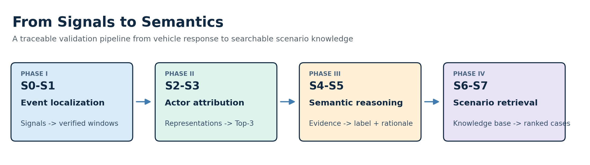
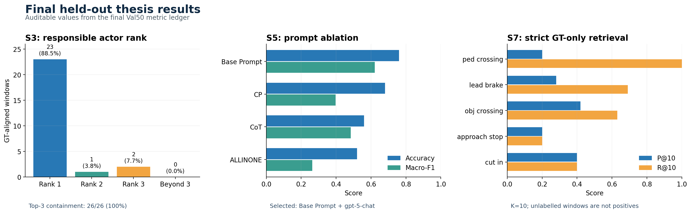
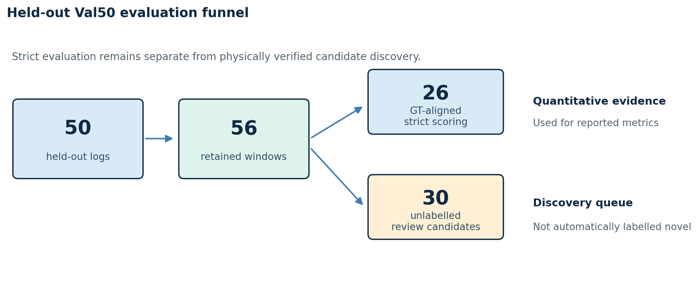

# Signals to Semantics

[](https://github.com/hariharan-c1/Signals_to_Semantics/actions/workflows/ci.yml)
[](https://www.python.org/)
[](LICENSE)
[](https://www.argoverse.org/av2.html)

**A traceable learning pipeline for mining, explaining, and retrieving safety-relevant driving scenarios.**

This repository is the public research artifact for the Master's thesis
*From Signals to Semantics: An LLM-Driven Learning Pipeline for Novel
Driving-Scenario Discovery*. It converts ego-vehicle motion into verified
braking events, responsible-actor hypotheses, structured semantic
explanations, and searchable scenario records.



## Recruiter snapshot

| | Evidence |
|---|---|
| **Problem** | Rare and safety-relevant interactions are difficult to find in large autonomous-driving datasets using metadata alone. |
| **System built** | An original S0–S7 research pipeline spanning signal processing, PU learning, contrastive representation learning, GATv2 ranking, evidence-constrained LLM reasoning, PostgreSQL/pgvector storage, and semantic retrieval. |
| **Research scale** | 700 Argoverse 2 Sensor logs: 650 development/training logs and a disjoint 50-log held-out evaluation split. |
| **Held-out results** | 26/26 annotated actors retained in the S3 Top-3, 23/26 at Rank 1 (88.5%), and S5 Macro-F1 of 0.621. |
| **Validation approach** | Fixed split manifests, stage-specific evaluation contracts, machine-readable result ledgers, artifact hashes, tests, CI, and one real S0–S7 trace. |
| **Scope** | Offline research and scenario-based validation—not a deployed driving or safety system, and not a claim of formal causality. |

## Run the evidence in under a minute

The first demo validates a real held-out S0–S7 trace already committed to the
repository. It checks all artifact hashes, cross-stage IDs, actor consistency,
and the documented S7 score calculation. It makes no network, database, LLM,
or dataset call.

```bash
git clone https://github.com/hariharan-c1/Signals_to_Semantics.git
cd Signals_to_Semantics
python -m pip install -e .

sts demo
```

A second offline demo runs the released S0/S1A braking detector on a
deterministic synthetic signal:

```bash
sts demo-synthetic
```

For the complete publication gate:

```bash
make check
```

## See one real scenario end to end

[](examples/hero_scenario/README.md)

The case study follows a real 2.25-second braking interaction through every
stage. S1 retained the event with an HMM posterior of 0.998678, S3 ranked the
reviewed trigger actor first, and S7 retrieved the same event at Rank 3 from a
natural-language query.

The trace also records a meaningful failure: the model returned
`obj_crossing`, while human review selected the narrower `cut_in` label. The
actor attribution remained correct. Reporting that disagreement makes it
possible to localize the error to semantic taxonomy selection rather than
event localization or actor ranking.

[Open the complete trace](examples/hero_scenario/README.md) ·
[Watch the 3.9-second clip](examples/hero_scenario/media/scenario_clip.mp4) ·
[Run its verifier](signals_to_semantics/demo.py)

## Final held-out results



The stages have different evaluation units and answer different questions;
they must not be combined into a single end-to-end accuracy.

| Component | Final result |
|---|---|
| S1 event localization | 56/56 Val50 windows retained; all 26 GT-aligned events preserved; 30 unlabelled review candidates; GT recall 1.000 |
| S3 actor ranking | 23/26 responsible actors at Rank 1 (88.5%); 24/26 within Top-2; 26/26 within Top-3 |
| S5 semantic reasoning | Base Prompt with `gpt-5-chat`, evaluated on one representative window from each of 25 GT logs: accuracy 0.760; Macro-F1 0.621 |
| S7 semantic retrieval | Strict GT-only Top-10 evaluation across five scenario classes; P@10 from 0.20 to 0.42 and R@10 from 0.20 to 1.00 |

The 30 unmatched windows form a **review queue**. They are not automatically
labelled as novel or correct scenarios.



See [the complete results](docs/RESULTS.md),
[metric provenance](docs/METRIC_PROVENANCE.md), and the
[machine-readable ledger](results/verified/final_defense_metrics.json).

## Pipeline

| Stage | Question | Method | Main output |
|---|---|---|---|
| S0 | Where is the physical cue? | Resampling, smoothing, velocity/acceleration/jerk features | Candidate braking windows |
| S1 | Is the event credible? | PU-XGBoost, nnPU, score fusion, EMA, and HMM stabilization | Canonical windows and confidence |
| S2 | How should nearby actors be represented? | 37-dimensional descriptors and contrastive learning | 128-dimensional actor embeddings |
| S3 | Which actor best explains the response? | Quasi-temporal graph construction and GATv2 ranking | Top-3 responsible-actor hypotheses |
| S4 | What evidence is safe to reason over? | Deterministic schema-bound evidence construction | Frozen evidence packet |
| S5 | What happened and why? | Closed-taxonomy, actor-constrained LLM inference | Structured scenario record |
| S6 | How is the trace preserved? | PostgreSQL, pgvector, integrity checks | Scenario knowledge base |
| S7 | Can the event be found by meaning? | Semantic retrieval and confidence-aware reranking | Ranked traceable scenarios |

The thesis-stable S1 sequence uses HMM smoothing. Experimental HSMM work and
other follow-up variants are outside this release.

## Engineering and research contributions

- Designed an event-mining pipeline that starts from measurable vehicle
  response rather than scenario labels.
- Combined positive-unlabelled learning with temporal stabilization to
  preserve recall under incomplete annotation.
- Integrated learned actor representations with graph attention to prioritize
  interaction partners before semantic reasoning.
- Defined deterministic evidence packets and JSON contracts that prevent the
  LLM from inventing actors outside the ranked candidate set.
- Built a normalized data lineage from event detection through retrieval,
  including human-review evidence and database integrity checks.
- Packaged the research as a testable Python project with fixed splits,
  sanitized configuration, CI, reproducible figures, and offline demos.

## Reproduction paths

### Tier 1 — repository-only validation

Requires Python 3.10–3.12 and no external data or services:

```bash
python -m pip install -e .
sts demo
sts demo-synthetic
make check
```

### Tier 2 — full research pipeline

Install the stage-specific dependencies:

```bash
python3.10 -m venv .venv
source .venv/bin/activate
python -m pip install --upgrade pip
python -m pip install -e ".[data,ml,llm,database,viz]"
```

Then obtain Argoverse 2 separately, configure local paths, and follow
[the stage-by-stage pipeline guide](docs/PIPELINE.md) and
[the evaluated protocol](docs/REPRODUCIBILITY.md). The exact PyTorch build may
need to be selected for the available CPU or CUDA platform.

## Dataset setup

1. Download the Argoverse 2 Sensor dataset separately.
2. Copy `configs/paths.example.yaml` to `configs/paths.yaml`.
3. Set `av2_sensor_root` to the local Sensor train directory.
4. Verify the fixed split manifests:

```bash
python scripts/s0/validate_splits.py \
  --splits_dir configs/splits \
  --train_root /absolute/path/to/argoverse2/sensor/train
```

The committed manifests define `dev100`, `train550`, `train650`, and the
held-out `val50`. `train650` is the union of `dev100` and `train550`;
`val50` is disjoint.

## Repository map

| Path | Contents |
|---|---|
| `signals_to_semantics/` | Reusable detection, AV2 loading, tagging, identifier, and demo utilities |
| `scripts/s0` … `scripts/s7` | Stage-oriented research pipeline and evaluation entry points |
| `configs/` | Sanitized templates, schemas, thresholds, and fixed split manifests |
| `examples/hero_scenario/` | Real S0–S7 trace, human review, poster, and short clip |
| `results/verified/` | Small, inspectable final evaluation ledgers only |
| `assets/` | Reproducible architecture and result figures generated from verified ledgers |
| `schemas/` | JSON Schemas for evidence and LLM output |
| `tests/` | Contract, metric, split, publication-safety, and demo tests |
| `docs/` | Pipeline, provenance, results, reproducibility, and limitations |

## LLM backends and credentials

`configs/llm_backends.yaml` defaults to local Ollama and contains no secret.
Azure OpenAI configuration is supplied through environment variables:

```bash
export AZURE_OPENAI_ENDPOINT="https://<resource>.openai.azure.com/"
export AZURE_OPENAI_API_KEY="<current-key>"
export AZURE_OPENAI_API_VERSION="<supported-api-version>"
export AZURE_OPENAI_DEPLOYMENT="<deployment-name>"
```

Never commit a populated `.env`, `configs/db.env`, or `configs/paths.yaml`.
The repository checker rejects common credential and machine-specific-path
patterns.

## Scope and limitations

This is an offline research pipeline, not a real-time driving or safety
system. The reported results are tied to the published AV2 split and the
documented evaluation contracts. They do not establish formal causality,
production safety, or cross-domain generalization. Human click timestamps
limit fine-grained temporal-boundary analysis, and LLM output may vary with
model revisions and serving configuration.

## Data, licensing, and provenance

Repository code and original documentation are released under the
[MIT License](LICENSE). Argoverse 2 must be obtained separately and remains
subject to its [official terms](https://www.argoverse.org/about.html#terms-of-use).
Dataset-derived media in the case study carries a separate
[data notice](examples/hero_scenario/media/DATA_LICENSE.md).

The closest research baseline is
[*Why Braking?*](https://arxiv.org/abs/2507.15874). The baseline-adapted source
directory from the research archive is not distributed in this repository;
all retained S0–S7 pipeline code was developed for this thesis. See
[NOTICE.md](NOTICE.md) and [provenance](docs/PROVENANCE.md).

## Author

**Hariharan Chandrasekaran**

**Automotive Software Engineer | AI & Machine Learning**

M.Sc. Automotive Software Engineering. Open to full-time opportunities in
ADAS/AD validation, autonomous-driving AI, and automotive software.

[LinkedIn](https://www.linkedin.com/in/hariharan-chandrasekaran-/) ·
[Email](mailto:hariharan.chandrasekaran25@gmail.com) ·
[GitHub](https://github.com/hariharan-c1)

## Citation

Use [CITATION.cff](CITATION.cff) to cite this software and thesis research.
