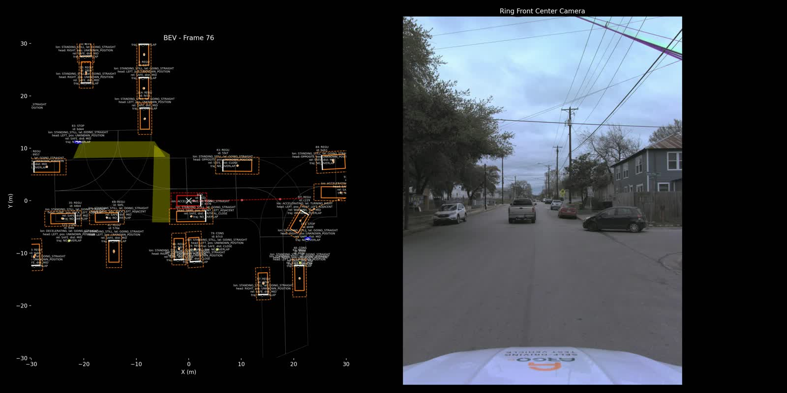

# End-to-end traceability case study

This case study follows one real held-out Argoverse 2 interaction through the
complete pipeline. It uses the same outputs shown in the final thesis defense
presentation.

[](media/scenario_clip.mp4)

Select the poster to open the 3.9-second MP4 clip.

Validate the complete published trace without external services:

```bash
python -m pip install -e .
sts demo
```

The verifier checks the ten artifact hashes, the shared canonical event ID,
the S3 Top-3 ordering, S5 actor containment, human/model actor agreement, and
the documented S7 hybrid-score calculation.

## One event, one trace

| Stage | Question | Observed output |
|---|---|---|
| S0 | Where is the physical cue? | A 2.25 s braking interval with minimum acceleration −3.792 m/s² and minimum jerk −13.609 m/s³ |
| S1 | Is the event retained? | Yes; HMM event posterior 0.998678 |
| S2 | How are actors represented? | Nine candidate actors, 37 input dimensions, and learned 128-dimensional embeddings |
| S3 | Which actor best explains the response? | ACTOR1 ranked first with score 1.044773 |
| S4 | What evidence reaches the reasoner? | Frozen event, Top-3 actor, kinematic, and map evidence |
| S5 | What happened? | Model output: `obj_crossing`, ACTOR1, confidence 0.83 |
| Human review | Does the interpretation hold? | ACTOR1 accepted as the primary trigger; reviewer label: `cut_in` |
| S7 | Can the event be found by meaning? | Rank 3 for the crossing-vehicle query; hybrid score 0.724211 |

Canonical identity:

```text
log_id: 768cf7e2-eb6c-3468-969e-e3b0fd87b34e
window: 315968692.3874254 to 315968694.6374254
```

## Stage artifacts

| File | Evidence shown |
|---|---|
| [`s0_candidate_window.json`](s0_candidate_window.json) | Raw candidate interval and braking extrema |
| [`s1_verification.json`](s1_verification.json) | PU-XGBoost, nnPU, fused, EMA, and HMM scores |
| [`s2_representation_summary.json`](s2_representation_summary.json) | Actor count, representation dimensions, vector norms, and hashes |
| [`s3_actor_ranking.json`](s3_actor_ranking.json) | Final Top-3 ranking and actor identifiers |
| [`s4_evidence_pack.json`](s4_evidence_pack.json) | Deterministic evidence boundary supplied to S5 |
| [`s5_llm_output.json`](s5_llm_output.json) | Original structured model response selected for the demonstration |
| [`human_validation.json`](human_validation.json) | Sanitized human-review decision |
| [`s7_retrieval_trace.json`](s7_retrieval_trace.json) | Query, score components, and returned rank |
| [`manifest.json`](manifest.json) | Provenance and SHA-256 checksums |

S7 normalizes timestamps to six decimal places for database keys. The S7
artifact records both that database key and the higher-precision source key so
their identity can be checked directly.

The final evaluation identifies the selected model as `gpt-5-chat`. The raw
S5 artifact retains its original provider-side `backend` field,
`azure-gpt-5-mini`. The S7 database record preserves both labels as
`model_name` and `provider_hint`; the response content has not been rewritten.

## What this case proves

The example demonstrates stage-to-stage traceability. S1 identifies a stable
event, S3 keeps the reviewed trigger at Rank 1, S4 freezes the supporting
evidence, and S7 retrieves the same event from a semantic query.

The semantic disagreement also identifies the main weakness precisely. S5
assigned the broader `obj_crossing` label, while the human reviewer selected
`cut_in`. The actor attribution remained correct. This is a useful validation
result because it localizes the error to taxonomy-level semantic reasoning
rather than event localization or actor ranking.

This single case does not establish aggregate accuracy or physical causality.
See [the final results](../../docs/RESULTS.md) for the evaluation denominators
and aggregate metrics.

## Data terms

The JSON files contain compact derived outputs. The poster and clip are
Argoverse-derived media and carry a separate
[dataset notice](media/DATA_LICENSE.md). Raw sensor data is not included.
